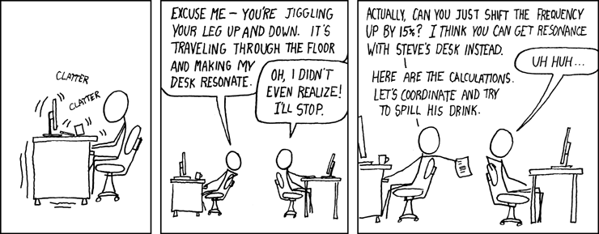

# Universidad Nacional de Colombia - Sede Manizales
# 4200371 - G1 - Vibraciones aleatorias

Fuente: <http://xkcd.com/228/>

- Profesor: [Diego Andrés Alvarez Marín](https://sites.google.com/site/diegoandresalvarezmarin/) (daalvarez@unal.edu.co)
- Horas de actividad presencial semanal: 4 horas.
  - Martes 16:00-18:00 Cxxx
  - Jueves 16:00-18:00 Cxxx
- Semanas: 16.
- Créditos: 4.
- Programa: Maestría en Ingeniería - Estructuras.
- Tipología: Asignatura elegible.

## Tabla de contenido:
- [Temario y observaciones generales del curso](docs/temario_y_observaciones_generales.md)
- [Recursos](docs/recursos.md)

# Material de estudio
0. [Introducción](../diapositivas/00_introduccion.pdf)
1. [Análisis de Fourier](../docs/01_analisis_de_fourier.md)
2. [Procesos estocásticos](../docs/02_procesos_estocasticos.md)
3. [Sistemas lineales](../docs/03_sistemas_lineales.md)

## Talleres
- [Taller 1](docs//taller_1.md)
- [Taller 2](Por definir)
