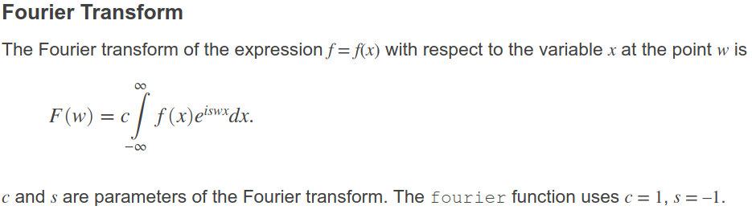
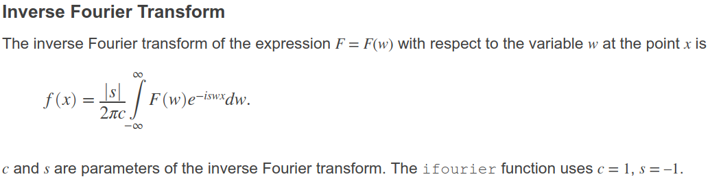
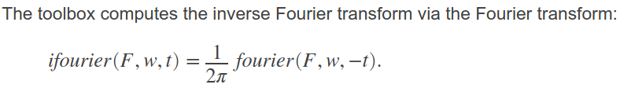

<font size="30">Análisis de Fourier</font>

# Diapositivas
* Conceptos superbásicos de análisis funcional: [01_conceptos_superbasicos_de_analisis_funcional.pdf](../diapositivas/01_conceptos_superbasicos_de_analisis_funcional.pdf)

* Algunas diapositivas sobre análisis de Fourier: [02_analisis_de_fourier.pdf](../diapositivas/02_analisis_de_fourier.pdf)

# Repaso de variable compleja
## Sitios de internet
De Julius O. Smith III - Discrete Fourier Transform with audio applications, 2 ed. https://ccrma.stanford.edu/~jos/mdft/mdft.html, estudiar los capítulos:
*   Introduction to the DFT
*   Complex Numbers
*   Proof of Euler's Identity
*   Sinusoids and Exponentials

# Series de Fourier y sus propiedades

## Sitios de internet
La clase la preparé con la WIKIPEDIA.
https://en.wikipedia.org/wiki/Fourier_series

## MAXIMA
En MAXIMA existe un paquete especializado en calcular series y transformadas de Fourier: `calculus/fourie.mac`. Si quiere aprender a usarlo, se refiere a: http://web.csulb.edu/~woollett/mbe10fltrans.pdf

* Serie de Fourier de g(t) = square wave, para t \in [-10, 10]:
[serie_fourier_gt_square_wave.mac](../codigo/fourier/01_series_de_fourier_con_MAXIMA/serie_fourier_gt_square_wave.mac)

* Serie de Fourier de g(t) = t, para t \in [-pi, pi]:
[serie_fourier_gt_t.mac](../codigo/fourier/01_series_de_fourier_con_MAXIMA/serie_fourier_gt_t.mac)

* Serie de Fourier de g(t) = 2*rect(t;1), para t \in [-2, 2]:
[serie_fourier_gt_2_rect_t.mac](../codigo/fourier/01_series_de_fourier_con_MAXIMA/serie_fourier_gt_2_rect_t.mac)

* Serie de Fourier de g(t) = abs(t), para t \in [-2, 2]:
[serie_fourier_gt_abs_t.mac](../codigo/fourier/01_series_de_fourier_con_MAXIMA/serie_fourier_gt_abs_t.mac)

## PYTHON (SymPy)
* https://docs.sympy.org/latest/modules/series/fourier.html


# Transformada de Fourier y sus propiedades

## Sitios de internet
La clase la preparé con:
* https://en.wikipedia.org/wiki/Fourier_transform
* Brigham - The fast fourier transform and its applications
http://at.dii.unipd.it/renato.gobbo/download/brigham/FFT&applications_1-4.pdf (capítulos 2 y 3)

## MATLAB
MATLAB calcula la transformada de Fourier y su correspondiente inversa utilizando las ecuaciones:





Tenga en cuenta que para calcular la transformada inversa de Fourier, MATLAB utiliza el procedimiento:



* Uso de los comandos `fourier()` e `ifourier()` de MATLAB:
  * https://www.mathworks.com/help/symbolic/compute-fourier-and-inverse-fourier-transforms.html (ejemplo interesante de una viga)
  * https://www.mathworks.com/help/symbolic/fourier.html
  * https://www.mathworks.com/help/symbolic/ifourier.html
  * [ej_transf_fourier.m](../codigo/fourier/02_transformada_de_fourier_MATLAB/ej_transf_fourier.m)

## PYTHON (SymPy)
Para ello se usan las funciones `fourier_transform()` y `inverse_fourier_transform()`:
* https://docs.sympy.org/latest/modules/integrals/integrals.html

# La transformada discreta de Fourier (DFT) y su implementación la FFT

## Sitios de internet
De Julius O. Smith III - Discrete Fourier Transform with audio applications, 2 ed. https://ccrma.stanford.edu/~jos/mdft/mdft.html, estudiar los capítulos:
*   Geometric Signal Theory
*   The DFT Derived

## MATLAB
* Programa para comparar la implementación de la DFT y la IDFT con los comandos `fft()` y `ifft()` de MATLAB: 
[dft_vs_fft.m](../codigo/fourier/dft_vs_fft.m)

* Calculo de la DFT utilizando el método matricial y comando `dftmtx()`: 
[dft_matricial.m](../codigo/fourier/dft_matricial.m)

* En MATLAB hay un interesante ejemplo que se invoca con los comandos:
```matlab
addpath(fullfile(matlabroot,'/help/techdoc/math/examples')) % MATLAB 2012a
addpath(fullfile(matlabroot,'/help/matlab/math/examples'))  % MATLAB 2015a
x = [0.2 1 0.3 -0.1 0.3 0.1];  % vector al que le sacaremos la DFT
fftgui(x);
```

Ensaye con los siguientes vectores:
```matlab
x = [1 zeros(1,11)];
x = [0 1 zeros(1,10)];
x = [ones(1,25),-ones(1,25)];
t = linspace(0,1,50); x = sin(2*pi*t);
```

## Aproximando la transformada de Fourier usando el comando `fft()`

## Sitios de internet
* Epstein - How Well Does the Finite Fourier Transform Approximate the Fourier Transform?: https://www.math.upenn.edu/~cle/papers/fftvsft.pdf
* Approximating the Fourier Transform with the Discrete Fourier Transform: http://www.ncbecker.de/python-course/chapter_11/script/fft.pdf [LINK MUERTO]
* Axelrod -  Approximating the Analytic Fourier Transform with the Discrete Fourier Transform: http://arxiv.org/abs/1508.01282

## MATLAB
[DFT_approximates_FT.m](../codigo/fourier/DFT_approximates_FT.m)


# Uso de las funciones `fft()`, `fftshift()`, `abs()`, `angle()` y `unwrap()`. Obtención de los espectros centrales y positivo

## MATLAB
* [fftTutorial.m](../codigo/fourier/fftTutorial.m)
* [centeredFFT.m](../codigo/fourier/centeredFFT.m)
* [positiveFFT.m](../codigo/fourier/positiveFFT.m)
* [fftTutorial_resuelto_como_serie_de_Fourier.m](../codigo/fourier/fftTutorial_resuelto_como_serie_de_Fourier.m)

# Zero padding

# Sitios de internet
* https://ccrma.stanford.edu/~jos/dft/Zero_Padding_Theorem_Spectral.html
* NI - Zero Padding Does Not Buy Spectral Resolution http://www.ni.com/tutorial/4880/en/
* http://www.embedded.com/design/other/4212939/Time-domain-interpolation-using-the-Fast-Fourier-Transform-

## MATLAB
Efectos del zero-padding. Uso de `nextpow2()`: 

NOTA: recuerde que el zero-padding no incrementa la información, simplemente es una herramienta útil para ver mejor los picos cuando las frecuencias están muy juntas.
* [centeredFFT_zero_padding.m](../codigo/fourier/centeredFFT_zero_padding.m)
* [positiveFFT_zero_padding.m](../codigo/fourier/positiveFFT_zero_padding.m)
* [zeroPadding_ex1.m](../codigo/fourier/zeroPadding_ex1.m)
* [zeroPadding_ex2.m](../codigo/fourier/zeroPadding_ex2.m)

# Interpolacion en el tiempo utilizando el algoritmo `ifft()` y la función `interpft()`
* [fft_interpolation_in_time.m](../codigo/fourier/fft_interpolation_in_time.m)

# Frequency-domain linear regression

## Sitios de internet
* http://www.mathworks.com/help/signal/ug/frequency-domain-linear-regression.html

# Significance Testing for Periodic Component

## Sitios de internet
* http://www.mathworks.com/help/signal/ug/significance-testing-for-periodic-component.html

# Ventaneo (windowing)

## Sitios de internet
* Definición matemática: https://en.wikipedia.org/wiki/Window_function
* NI - Understanding FFTs and Windowing: http://www.ni.com/white-paper/4844/en/
* http://www.bores.com/courses/advanced/windows/files/windows.pdf (FALTA LEER, PERO COMPLETO CONCEPTUALMENTE)
* http://www.bores.com/courses/advanced/windows/index.htm
* Michael Cerna and Audrey F. Harvey (2000). "The Fundamentals of FFT-Based Signal Analysis and Measurement" http://www.sjsu.edu/people/burford.furman/docs/me120/FFT_tutorial_NI.pdf

## MATLAB
* Ventanas soportadas por el signal processing toolbox de MATLAB:https://www.mathworks.com/help/signal/windows.html

* Herramientas para visualizar y diseñar ventanas:
  * `wintool` - Window Design & Analysis Tool
  * `wvtool` - Window Visualization Tool
  * `sigdemo1` - DFT demo

```matlab
% EJEMPLOS:
% #1 - Analysis of a window object
w = sigwin.chebwin(64,100);
wintool(w);
wvtool(w);

% o alternativamente
w = chebwin(64,100);
wvtool(w);
wintool(w);

% #2 - Analysis of multiple window objects
w1 = sigwin.bartlett(64);
w2 = sigwin.hamming(64);
wintool(w1,w2);
wvtool(w1,w2);

% o alternativamente
w1 = bartlett(64);
w2 = hamming(64);
wvtool(w1,w2);
wintool(w1,w2);

% #3 - Compare Kaiser window objects with different beta values:
H1 = sigwin.kaiser(128,1.5);
H2 = sigwin.kaiser(128,4.5);
wvtool(H1,H2)
wintool(H1,H2)
```

* Ejemplo windowing: [ex_windowing.m](../codigo/fourier/ex_windowing.m)

# Entendiendo la fase

## MATLAB
* http://www.mathworks.com/matlabcentral/fileexchange/48025-phase-difference-measurement-with-matlab-implementation
* http://www.mathworks.com/matlabcentral/fileexchange/29075-find-phase-difference-between-2-sinusoidal-signals
* http://www.mathworks.com/matlabcentral/fileexchange/50559-amplitude-ratio-and-phase-difference-measurement-with-matlab-implementation

# Short-Time Fourier Transform

Adjunto tres códigos: uno de mi autoría y otros dos que bajé de internet. Me queda como tarea fusionar los tres códigos en un solo ejemplo.
* [ex_spectrogram.m](../codigo/fourier/ex_spectrogram.m)
* [example_wikipedia.zip](../codigo/fourier/example_wikipedia.zip)
* [time_frequency_analysis_using_stft.zip](../codigo/fourier/time_frequency_analysis_using_stft.zip)
